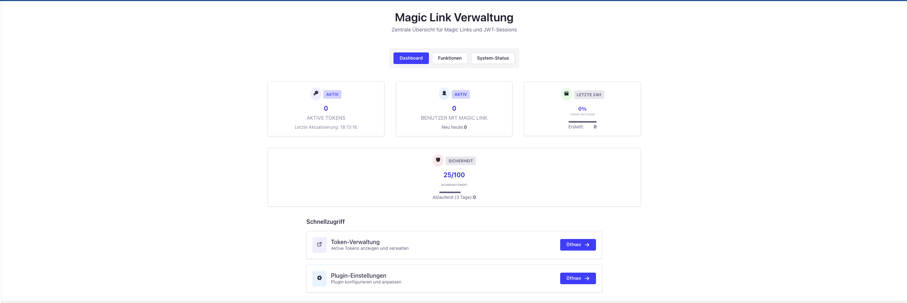
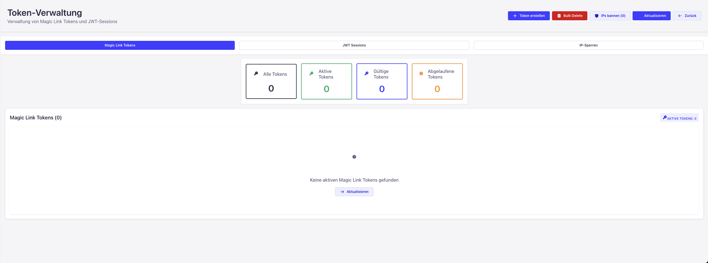
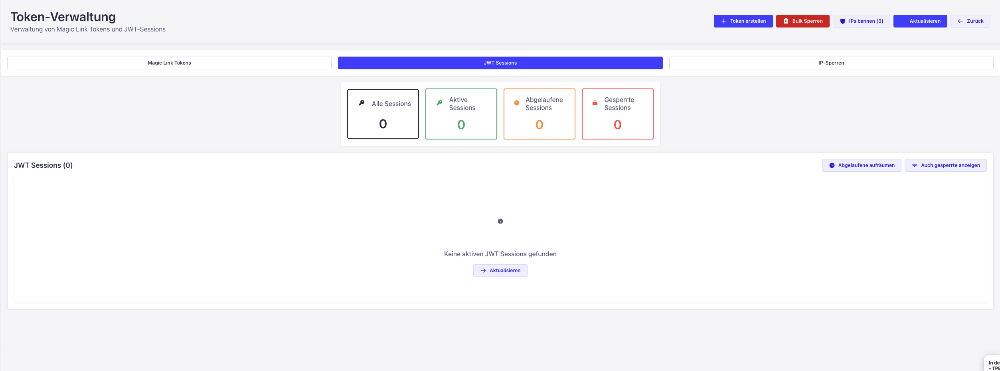
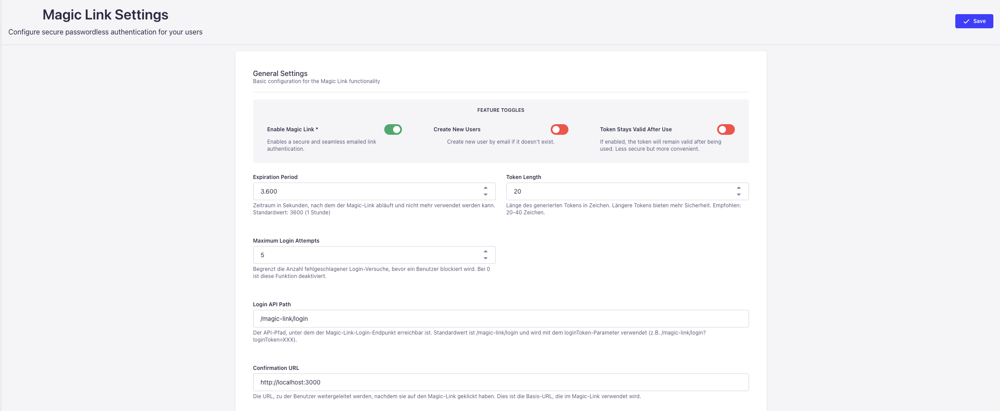
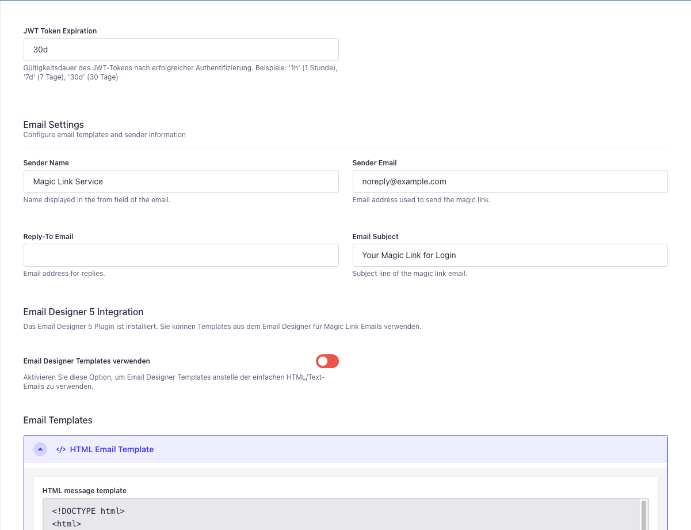

# Magic Link - Passwordless Authentication for Strapi

A secure passwordless authentication solution for Strapi, allowing users to log in via email links without requiring passwords.



## Core Features

- **Passwordless Authentication**: Login via secure email links
- **Token Management**: Admin dashboard for managing and monitoring tokens
- **JWT Session Tracking**: Monitor and manage active sessions
- **Security Features**: IP banning, token expiration controls
- **Admin Interface**: Statistics dashboard and configuration options



## Installation

```bash
# Using npm
npm install magic-link

# Using yarn
yarn add magic-link
```

After installation, restart your Strapi server and the plugin will be available in the admin panel.

## How It Works

### Email User with Login Link

1. **Request Process**:

   - User requests a login link by entering their email
   - System generates a secure token and sends an email
   - Email contains a magic link with the token

2. **Token Details**:
   - Cryptographically secure random tokens
   - Configurable expiration time
   - Option for one-time use or reusable tokens
   - Tracks IP address and user agent information

### Login with Token

1. **Authentication Process**:

   - User clicks the link in their email
   - System verifies the token is valid and not expired
   - User is automatically authenticated
   - JWT token is generated for the session

2. **Security Measures**:
   - IP address validation (optional)
   - Token expiration
   - One-time use tokens (configurable)
   - Automatic blocking after failed attempts



## Configuration

Configure the plugin through **Settings > Magic Link** in the Strapi admin panel:



### General Settings

- **Enable Magic Link**: Turn the feature on/off
- **Create New Users**: Automatically create users if they don't exist
- **Token Stays Valid**: Configure one-time use or reusable tokens
- **Expiration Period**: Set how long tokens remain valid
- **Token Length**: Configure the security level of tokens

### Authentication Settings

- **Default Role**: Select which user role is assigned to new users
- **JWT Token Expiration**: Define how long JWT tokens remain valid (e.g., 30d, 24h)
- **Store Login Info**: Enable tracking of user agents and IP addresses
- **Remember Me**: Allow users to stay logged in for extended periods

### Email Settings

- **Sender Information**: Configure the email sender details (name, email)
- **Reply-To Address**: Set a reply-to email address for support inquiries
- **Email Subject**: Customize the subject line of the magic link emails
- **Email Templates**: Customize HTML and text templates
- **Email Designer Integration**: Use with Email Designer 5 if installed

## Dashboard & Admin Interface

Magic Link provides a comprehensive admin interface with several key sections:



### Dashboard Overview

- **Security Score**: Dynamic score (0-100) showing your current security configuration
- **Active Tokens**: Count and management of currently active tokens
- **Token Usage**: Metrics on token creation and usage patterns
- **Users Using Magic Link**: Number of unique users authenticating via magic links
- **Tokens About to Expire**: Warning system for tokens expiring soon

### Token Management

- **Token List View**: Sortable and filterable list of all tokens
- **Token Status Indicators**: Visual indicators showing token status (active, expired, used)
- **Token Details**: Inspect complete token information including:
  - Creation and expiration dates
  - IP address and user agent information
  - Usage history and context data
- **Bulk Actions**: Select multiple tokens for batch operations
- **Search & Filter**: Find tokens by email, status, or creation date
- **Token Operations**:
  - Block/deactivate tokens
  - Extend token expiration
  - Delete tokens

### JWT Session Management

- **Active Sessions**: Monitor all active JWT sessions across your application
- **Session Revocation**: Ability to revoke any active session immediately
- **Session Details**: View complete session information including:
  - User details
  - Creation and expiration time
  - Last activity
  - IP address and device information

### Security Features

- **IP Ban Management**: View and manage banned IP addresses
- **IP Ban Controls**: Ban suspicious IPs and view associated tokens
- **Security Audit**: Track login attempts and security events
- **System Status**: Monitor the health of the plugin and its dependencies

### Token Creation Interface

- **Manual Token Creation**: Generate tokens for specific users
- **Email Control**: Option to send or not send the email with the token
- **Context Injection**: Add custom JSON context data to tokens
- **Email Validation**: Verify email existence before token creation

## Admin Features

### Token Management

- View all active/inactive tokens
- Block or activate individual tokens
- Delete expired tokens
- See token usage statistics

### Security Dashboard

- Security score based on your configuration
- IP banning for suspicious activity
- JWT session monitoring and management
- Token expiration warnings

## API Endpoints

- `POST /api/magic-link/send` - Generate and send a magic link
- `GET /api/magic-link/login?loginToken=xxx` - Authenticate with token
- `GET /api/magic-link/tokens` - List tokens (admin only)
- `GET /api/magic-link/jwt-sessions` - List active sessions (admin only)
- `POST /api/magic-link/tokens/:id/block` - Block a specific token
- `POST /api/magic-link/ban-ip` - Ban an IP address

## Frontend Implementation

```javascript
// Request a magic link
const requestLogin = async (email) => {
  try {
    await axios.post("/api/magic-link/send", { email });
    // Show success message
  } catch (error) {
    // Handle error
  }
};

// Verify token on the callback page
const verifyToken = async () => {
  const token = new URLSearchParams(window.location.search).get("loginToken");
  if (token) {
    try {
      const response = await axios.get(
        `/api/magic-link/login?loginToken=${token}`
      );
      // Store JWT and redirect user
      localStorage.setItem("token", response.data.jwt);
      window.location.href = "/dashboard";
    } catch (error) {
      // Handle invalid token
    }
  }
};
```

## Context Data

You can include additional context when sending a magic link:

```javascript
await axios.post("/api/magic-link/send", {
  email: "user@example.com",
  context: {
    redirectUrl: "/dashboard",
    source: "registration",
  },
});
```

## Security Best Practices

- Set reasonable token expiration times
- Use one-time tokens for sensitive operations
- Regularly monitor the security dashboard
- Ban suspicious IP addresses promptly

## Troubleshooting

| Issue                  | Solution                                       |
| ---------------------- | ---------------------------------------------- |
| Emails not sending     | Check your Strapi email provider configuration |
| Token validation fails | Verify token expiration settings               |
| User not found errors  | Check "Create New Users" setting               |

## License

[MIT](LICENSE)

## Development & Contributing

### Release Process

This project uses [semantic-release](https://github.com/semantic-release/semantic-release) to automate version management and package publishing.

To create a new release:

```bash
npx semantic-release
```

This will automatically:

1. Analyze commit messages since the last release
2. Determine the appropriate version bump (major, minor, or patch)
3. Generate release notes
4. Update the version in package.json
5. Create a new Git tag
6. Publish the package to npm

### Commit Guidelines

To ensure semantic-release can properly determine the next version number, please follow these commit message conventions:

#### Commit Message Format

Each commit message consists of a **header**, an optional **body**, and an optional **footer**:

```
<type>(<scope>): <subject>
<BLANK LINE>
<body>
<BLANK LINE>
<footer>
```

The **header** is mandatory and must conform to the following format:

- **type**: What type of change this commit is making. Must be one of:

  - `feat`: A new feature (triggers a minor release)
  - `fix`: A bug fix (triggers a patch release)
  - `docs`: Documentation changes only
  - `style`: Changes that don't affect code functionality (formatting, etc.)
  - `refactor`: Code changes that neither fix a bug nor add a feature
  - `perf`: Performance improvements
  - `test`: Adding or updating tests
  - `chore`: Changes to build process or auxiliary tools
  - `ci`: Changes to CI configuration files and scripts

- **scope**: Optional, can be anything specifying the place of the commit change (e.g., `admin`, `api`, `auth`)

- **subject**: Brief description of the change

#### Breaking Changes

For breaking changes, add `BREAKING CHANGE:` in the footer of the commit message or append a `!` after the type/scope:

```
feat(api)!: completely restructure API endpoints

BREAKING CHANGE: The API endpoints have been completely restructured.
```

This will trigger a major version bump.

#### Examples

```
feat(auth): add support for multiple roles

fix(email): correct template rendering issue

docs: update API documentation

chore(deps): update dependencies

fix!: critical security vulnerability in token validation
```

### Branching Strategy

- `main`: Production-ready code
- `develop`: Integration branch for features
- `feature/*`: New features
- `fix/*`: Bug fixes
- `docs/*`: Documentation changes

When creating PRs, always merge feature branches into `develop` first. The `develop` branch is periodically merged into `main` for releases.

---

## Support

If you encounter issues or have questions, please check the admin documentation or open an issue.
