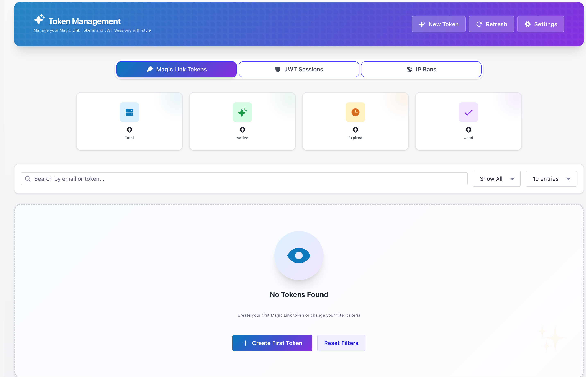
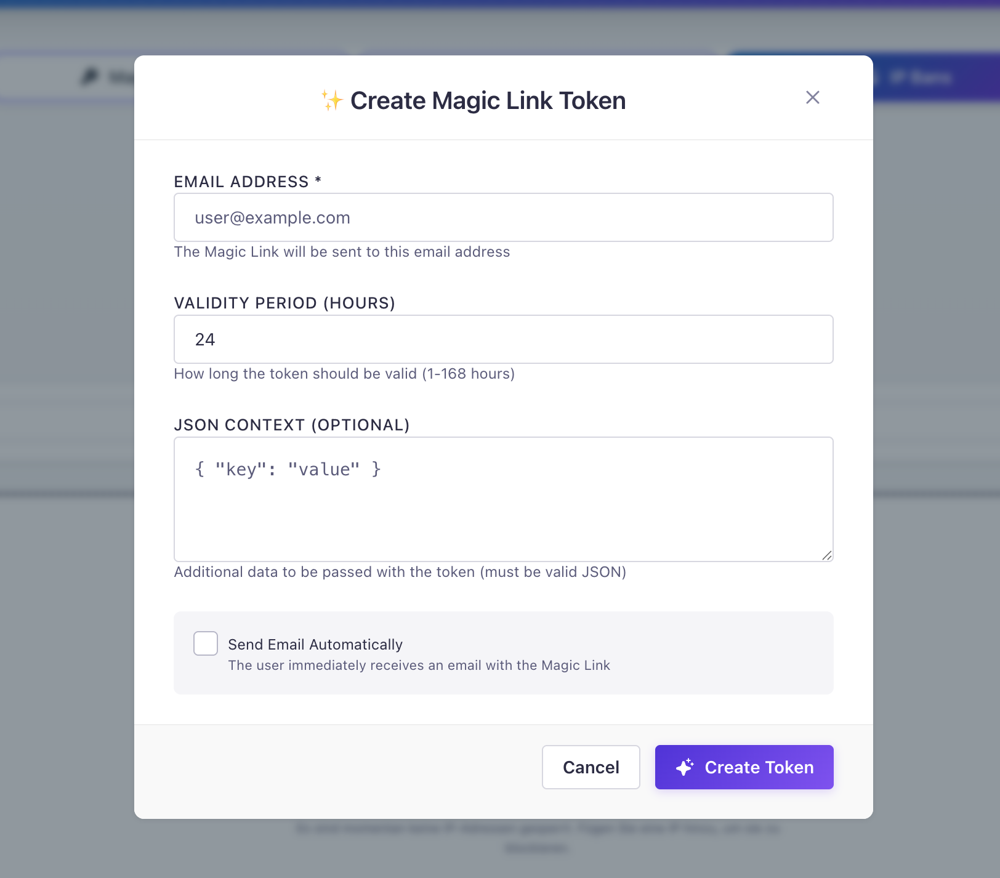
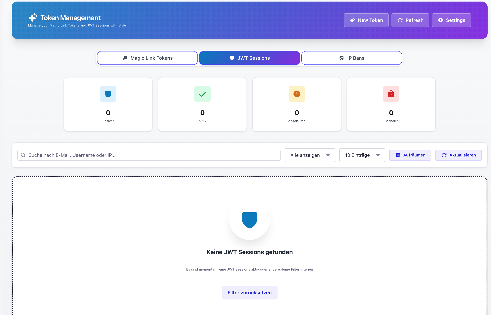
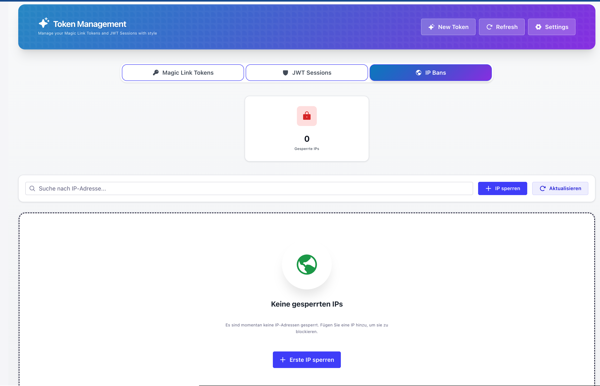
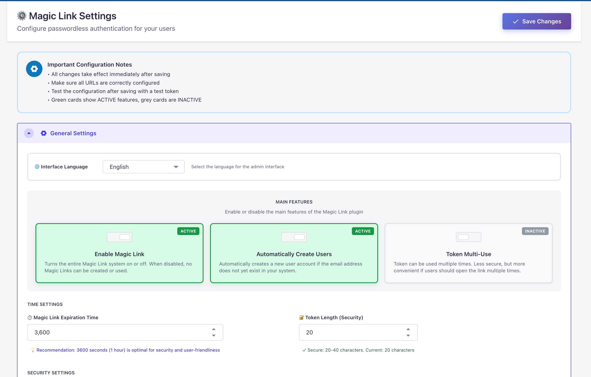
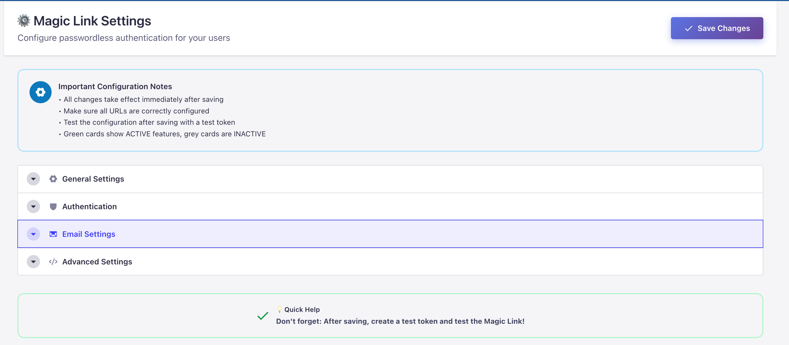

# 🔐 Magic Link - Passwordless Authentication for Strapi v5

**The most advanced passwordless authentication plugin for Strapi v5**

Secure, modern, and user-friendly authentication using email-based magic links, OTP codes, and TOTP authenticators. Built for production with enterprise-grade security features.

[](LICENSE)
[](https://www.npmjs.com/package/strapi-plugin-magic-link-v5)
[](https://strapi.io)

## 🚀 Why Magic Link?

- ⚡ **Zero Setup Time** - Install, activate license (free), and start using
- 🎯 **Production Ready** - Battle-tested with rate limiting, IP bans, and session management
- 🛡️ **Multi-Factor Authentication** - Email OTP + TOTP Authenticator support
- 🎨 **Beautiful UI** - Modern, responsive admin interface with German translations
- 🔒 **Enterprise Security** - License-based feature unlocking with Free, Premium & Advanced tiers

## 📚 Quick Links

- [✨ Features](#-features) - Authentication modes, security, license tiers
- [🚀 Installation](#-installation) - Get started in minutes
- [🎯 Quick Start](#-quick-start) - License activation & configuration
- [💻 Frontend Examples](#-frontend-implementation) - Magic Link, Email OTP, TOTP flows
- [📡 API Endpoints](#-api-endpoints) - Complete API reference
- [⚙️ Configuration](#-configuration) - All settings explained
- [🐛 Troubleshooting](#-troubleshooting) - Common issues & solutions
- [📝 Changelog](#-changelog) - Version history & updates

## 🌍 Supported Languages

The admin interface is available in **5 languages** for international accessibility:

- 🇬🇧 **English** - Global standard
- 🇩🇪 **Deutsch** - German (DACH region)
- 🇫🇷 **Français** - French (Strapi's home & community)
- 🇪🇸 **Español** - Spanish (Spain & Latin America)
- 🇵🇹 **Português** - Portuguese (Brazil & Portugal)

Users can switch languages in **Settings → Magic Link → Interface Language**.

---

## 📜 License

This plugin is licensed under the **MIT License** - free for everyone to use!

### What you CAN do:
- ✅ Use the plugin freely (personal & commercial)
- ✅ View and study the source code
- ✅ Report issues and contribute improvements
- ✅ Deploy in production without fees
- ✅ Integrate in your commercial projects

### What you CANNOT do:
- ❌ Remove or bypass the license validation system
- ❌ Modify `license-guard.js` or license-related endpoints
- ❌ Disable license activation requirements

**Important:** The license validation system must remain intact and functional. This ensures quality, support, and continued development. Users must activate the plugin (free) through the admin interface.

📄 See [LICENSE](./LICENSE) for full terms  

---

## ✨ Features

### 🔐 Authentication Modes

Choose the security level that fits your needs:

| Mode | Description | License |
|------|-------------|---------|
| **Magic Link Only** | One-click email login - fast & user-friendly | ✅ Free |
| **Magic Link + Email OTP** | 6-digit code after magic link click | 💎 Premium |
| **Magic Link + TOTP (MFA)** | Authenticator app (Google Auth, Authy) | ⚡ Advanced |
| **TOTP-Only Login** | Direct login with email + TOTP code | ⚡ Advanced |

### 🛡️ Security Features

- **Rate Limiting** - 5 requests per 15 minutes (configurable)
- **IP Banning** - Block suspicious addresses with one click
- **Session Management** - Monitor and revoke active JWT sessions
- **Login Tracking** - Store IP addresses and user agents
- **Token Expiration** - Configurable validity periods
- **Brute Force Protection** - Login attempt limiting
- **Security Score** - Real-time configuration assessment

### � License Tiers

| Feature | Free | Premium | Advanced |
|---------|------|---------|----------|
| Magic Link Login | ✅ | ✅ | ✅ |
| Token Management | ✅ | ✅ | ✅ |
| IP Banning | ✅ | ✅ | ✅ |
| Rate Limiting | ✅ | ✅ | ✅ |
| Email OTP | ❌ | ✅ | ✅ |
| TOTP Authenticator | ❌ | ❌ | ✅ |
| TOTP-Only Login | ❌ | ❌ | ✅ |

### 🎨 Admin Interface

- **Modern Dashboard** - Beautiful token statistics and charts
- **Mobile Optimized** - Perfect icon centering on all screen sizes
- **German Translations** - Fully localized UI (5 languages total)
- **License Management** - Visual tier display and feature unlocking
- **Professional Token Management** - Create, extend, block, delete
- **Search & Filter** - Find anything in seconds
- **Bulk Operations** - Manage multiple items at once

### ⚙️ Customization

- **Email Templates** - HTML & plain text with variables
- **Email Designer 5** - Visual email builder integration
- **Flexible Configuration** - All settings in admin panel
- **Custom Callbacks** - Post-login redirect URLs
- **Auto User Creation** - Optional on first login
- **Token Reusability** - One-time or multi-use tokens

---

## 📸 Screenshots

### Token Management Dashboard
Professional interface for managing magic link tokens with real-time statistics.



### Create New Token
Simple modal to create tokens with custom TTL and context data.



### JWT Session Management
Monitor and manage all active JWT sessions across your application.



### IP Ban Management
Security feature to block suspicious IP addresses.



### Settings Interface
Comprehensive settings panel with modern UI.



### General Settings
Configure core functionality and authentication options.



---

## 📋 Prerequisites

This plugin requires a **configured email provider** to send magic link emails.

### Email Provider Setup

**Option 1: Nodemailer (Recommended)**

Install the Strapi email plugin:

```bash
npm install @strapi/provider-email-nodemailer
```

Configure in `config/plugins.js`:

```javascript
module.exports = ({ env }) => ({
  email: {
    config: {
      provider: 'nodemailer',
      providerOptions: {
        host: env('SMTP_HOST', 'smtp.gmail.com'),
        port: env('SMTP_PORT', 587),
        auth: {
          user: env('SMTP_USERNAME'),
          pass: env('SMTP_PASSWORD'),
        },
      },
      settings: {
        defaultFrom: env('SMTP_DEFAULT_FROM', 'noreply@example.com'),
        defaultReplyTo: env('SMTP_DEFAULT_REPLY_TO', 'support@example.com'),
      },
    },
  },
});
```

**Option 2: Other Email Providers**

You can use any Strapi-compatible email provider:
- SendGrid
- Mailgun  
- Amazon SES
- Postmark
- Any SMTP service

See [Strapi Email Documentation](https://docs.strapi.io/dev-docs/plugins/email) for details.

### Email Designer 5 Integration (Optional)

This plugin is **fully compatible** with [Strapi Email Designer 5](https://www.npmjs.com/package/strapi-plugin-email-designer-5)!

```bash
# Install Email Designer 5
npm install strapi-plugin-email-designer-5
```

Once installed, you can:
- ✅ Create beautiful email templates in the visual designer
- ✅ Use template variables: `magicLink`, `token`, `user`, `expiresAt`
- ✅ Enable in Settings → Magic Link → Email Settings

---

## 🚀 Installation

```bash
# Using npm
npm install strapi-plugin-magic-link-v5

# Using yarn
yarn add strapi-plugin-magic-link-v5

# Using pnpm
pnpm add strapi-plugin-magic-link-v5
```

After installation, **restart your Strapi server**. The plugin will appear in your admin panel.

---

## 🎯 Quick Start

### 1️⃣ First Time Setup - License Activation (Free)

**After installation, you'll see a license activation modal on first visit.**

Enter your details to activate the plugin (completely free):

```
Email Address: your-email@example.com
First Name: John
Last Name: Doe
```

Click **"Create License"** and you're done! The plugin will:
- ✅ Automatically register your installation
- ✅ Activate all features (no payment required)
- ✅ Connect to the license validation system

**Important:** This is a **free activation** - not a payment. It helps us track installations, provide support, and ensure security. You can also use an existing license key if you already have one.

### 2️⃣ Configure Settings

**Navigate to:** Settings → Magic Link → Settings

**Essential Configuration:**

```javascript
{
  // Core Settings
  "enabled": true,
  "createUserIfNotExists": true,    // Auto-create users on first login
  "expire_period": 3600,             // Token valid for 1 hour (3600s)
  "token_length": 20,                // Token security level (20-40 chars)
  
  // Email Configuration
  "from_email": "noreply@yourdomain.com",
  "from_name": "Your App Name",
  "object": "Your Magic Link Login",
  "confirmationUrl": "https://yourdomain.com/auth/callback",
  
  // Rate Limiting
  "rate_limit_enabled": true,
  "rate_limit_max_attempts": 5,      // 5 requests per window
  "rate_limit_window_minutes": 15    // 15 minute window
}
```

**Choose Authentication Mode:**
- Go to **Settings → MFA & Login Modes**
- Select your preferred mode (Magic Link Only is default and free)
- Configure OTP/TOTP settings if using Premium/Advanced features

### 3️⃣ Frontend Implementation

#### 🔗 Basic Magic Link Flow

**Step 1: Request a magic link**
```javascript
const response = await fetch('/api/magic-link/send-link', {
  method: 'POST',
  headers: { 'Content-Type': 'application/json' },
  body: JSON.stringify({
    email: 'user@example.com',
    context: { redirectTo: '/dashboard' }
  })
});

const data = await response.json();
console.log('Magic link sent!', data);
```

**Step 2: Verify token on callback page**
```javascript
const urlParams = new URLSearchParams(window.location.search);
const loginToken = urlParams.get('loginToken');

if (loginToken) {
  try {
    const response = await fetch(`/api/magic-link/login?loginToken=${loginToken}`);
    const { jwt, user } = await response.json();
    
    // Store JWT for authenticated requests
    localStorage.setItem('token', jwt);
    localStorage.setItem('user', JSON.stringify(user));
    
    // Redirect to dashboard
    window.location.href = '/dashboard';
  } catch (error) {
    console.error('Login failed:', error);
    alert('Invalid or expired magic link');
  }
}
```

#### 📧 Email OTP Flow (Premium)

**Step 1: Request magic link (same as above)**

**Step 2: User clicks magic link → redirected to OTP page**

**Step 3: Verify OTP code**
```javascript
async function verifyOTP(email, otpCode) {
  const response = await fetch('/api/magic-link/verify-otp', {
    method: 'POST',
    headers: { 'Content-Type': 'application/json' },
    body: JSON.stringify({
      email: email,
      otp: otpCode
    })
  });

  if (response.ok) {
    const { jwt, user } = await response.json();
    localStorage.setItem('token', jwt);
    localStorage.setItem('user', JSON.stringify(user));
    window.location.href = '/dashboard';
  } else {
    alert('Invalid OTP code. Please try again.');
  }
}

// Usage
const otpInput = document.getElementById('otp-input');
verifyOTP('user@example.com', otpInput.value);
```

#### 🔐 TOTP Setup Flow (Advanced)

**Step 1: Setup TOTP for user (requires authentication)**
```javascript
async function setupTOTP() {
  const token = localStorage.getItem('token');
  
  const response = await fetch('/api/magic-link/totp/setup', {
    method: 'POST',
    headers: {
      'Authorization': `Bearer ${token}`,
      'Content-Type': 'application/json'
    }
  });

  const { secret, qrCode, otpauthUrl } = await response.json();
  
  // Display QR code to user
  document.getElementById('qr-code').innerHTML = ``;
  
  // Show secret for manual entry
  document.getElementById('secret').textContent = secret;
  
  return secret;
}
```

**Step 2: Verify TOTP code**
```javascript
async function verifyTOTP(totpCode) {
  const token = localStorage.getItem('token');
  
  const response = await fetch('/api/magic-link/totp/verify', {
    method: 'POST',
    headers: {
      'Authorization': `Bearer ${token}`,
      'Content-Type': 'application/json'
    },
    body: JSON.stringify({
      token: totpCode
    })
  });

  if (response.ok) {
    alert('TOTP successfully enabled!');
    return true;
  } else {
    alert('Invalid code. Please try again.');
    return false;
  }
}
```

**Step 3: Login with Email + TOTP (Alternative Login)**
```javascript
async function loginWithTOTP(email, totpCode) {
  const response = await fetch('/api/magic-link/totp/login', {
    method: 'POST',
    headers: { 'Content-Type': 'application/json' },
    body: JSON.stringify({
      email: email,
      token: totpCode
    })
  });

  if (response.ok) {
    const { jwt, user } = await response.json();
    localStorage.setItem('token', jwt);
    localStorage.setItem('user', JSON.stringify(user));
    window.location.href = '/dashboard';
  } else {
    alert('Invalid credentials');
  }
}
```

#### 🔍 Check License Tier (Client-side)

```javascript
async function checkLicenseTier() {
  const adminToken = localStorage.getItem('adminToken');
  
  const response = await fetch('/magic-link/license/status', {
    headers: {
      'Authorization': `Bearer ${adminToken}`
    }
  });

  const { data } = await response.json();
  
  // data.features.premium - Email OTP available
  // data.features.advanced - TOTP MFA available
  // data.features.enterprise - All features
  
  return {
    isPremium: data.features?.premium || false,
    isAdvanced: data.features?.advanced || false,
    isEnterprise: data.features?.enterprise || false
  };
}

// Usage
const license = await checkLicenseTier();
if (license.isPremium) {
  console.log('Email OTP is available!');
}
```

---

## 📡 API Endpoints

### 🌐 Public Endpoints (No Auth Required)

#### Authentication
| Method | Endpoint | Description |
|--------|----------|-------------|
| `POST` | `/api/magic-link/send-link` | Generate and send magic link to email |
| `GET` | `/api/magic-link/login?loginToken=xxx` | Authenticate user with token |
| `POST` | `/api/magic-link/verify-otp` | Verify Email OTP code |
| `POST` | `/api/magic-link/totp/login` | Login with Email + TOTP code |

#### TOTP Management (User Auth Required)
| Method | Endpoint | Description |
|--------|----------|-------------|
| `POST` | `/api/magic-link/totp/setup` | Generate TOTP secret & QR code |
| `POST` | `/api/magic-link/totp/verify` | Verify and enable TOTP |
| `POST` | `/api/magic-link/totp/disable` | Disable TOTP for user |
| `GET` | `/api/magic-link/totp/status` | Check if TOTP is configured |

### 🔐 Admin Endpoints (Admin Auth Required)

#### Token Management
| Method | Endpoint | Description |
|--------|----------|-------------|
| `GET` | `/magic-link/tokens` | List all magic link tokens |
| `POST` | `/magic-link/tokens` | Create a new token |
| `DELETE` | `/magic-link/tokens/:id` | Permanently delete a token |
| `POST` | `/magic-link/tokens/:id/block` | Block a token |
| `POST` | `/magic-link/tokens/:id/activate` | Activate blocked token |
| `POST` | `/magic-link/tokens/:id/extend` | Extend token validity |

#### Security & Monitoring
| Method | Endpoint | Description |
|--------|----------|-------------|
| `GET` | `/magic-link/jwt-sessions` | List active JWT sessions |
| `POST` | `/magic-link/revoke-jwt` | Revoke a JWT session |
| `POST` | `/magic-link/ban-ip` | Ban an IP address |
| `DELETE` | `/magic-link/ban-ip/:ip` | Unban an IP address |
| `GET` | `/magic-link/banned-ips` | List all banned IPs |
| `GET` | `/magic-link/rate-limit/stats` | Get rate limit statistics |
| `POST` | `/magic-link/rate-limit/cleanup` | Cleanup expired entries |

#### OTP Management
| Method | Endpoint | Description |
|--------|----------|-------------|
| `GET` | `/magic-link/otp-codes` | List all OTP codes |
| `POST` | `/magic-link/otp-codes/cleanup` | Cleanup expired OTP codes |

#### License Management
| Method | Endpoint | Description |
|--------|----------|-------------|
| `GET` | `/magic-link/license/status` | Get current license status |
| `POST` | `/magic-link/license/auto-create` | Create license with admin data |
| `POST` | `/magic-link/license/activate` | Activate license with key |

---

## ⚙️ Configuration

### 🔐 Authentication Mode Settings

**Configure in Admin Panel → Settings → MFA & Login Modes**

```javascript
{
  // Authentication Modes (mutually exclusive)
  "otp_enabled": false,            // Enable Email OTP (Premium)
  "mfa_require_totp": false,       // Enable TOTP MFA (Advanced)
  "totp_as_primary_auth": false,   // Enable TOTP-only login (Advanced)
  
  // Email OTP Configuration (Premium)
  "otp_type": "email",             // "email" | "sms" | "totp"
  "otp_length": 6,                 // Code length (4-8 digits)
  "otp_expiry": 300,               // Validity in seconds (default: 5 min)
  "otp_max_attempts": 3,           // Max verification attempts
  "otp_resend_cooldown": 60,       // Cooldown before resend (seconds)
  
  // TOTP Configuration (Advanced)
  "totp_issuer": "Magic Link",     // Displayed in authenticator app
  "totp_digits": 6,                // Code digits (6 or 8)
  "totp_period": 30,               // Time period (seconds)
  "totp_algorithm": "sha1"         // "sha1" | "sha256" | "sha512"
}
```

### ⚙️ General Settings

```javascript
{
  "enabled": true,                 // Enable/disable plugin
  "createUserIfNotExists": true,   // Auto-create users on first login
  "expire_period": 3600,           // Token expiration (seconds)
  "token_length": 20,              // Token security level (20-40)
  "stays_valid": false,            // Token reusable after first use
  "max_login_attempts": 5,         // Limit failed login attempts
  "callback_url": "https://yourdomain.com/auth/callback"
}
```

### 📧 Email Settings

```javascript
{
  "from_name": "Your App",
  "from_email": "noreply@yourdomain.com",
  "response_email": "support@yourdomain.com",
  "object": "Your Magic Link Login",
  "message_html": "<h1>Welcome!</h1><p>Click to login: <a href='<%= URL %>?loginToken=<%= CODE %>'>Login</a></p>",
  "message_text": "Your login link: <%= URL %>?loginToken=<%= CODE %>"
}
```

**Template Variables:**
- `<%= URL %>` - Your confirmation URL
- `<%= CODE %>` - The generated token
- `<%= USER %>` - User email/username
- `<%= EXPIRES_AT %>` - Token expiration time

### 🔒 JWT Settings

```javascript
{
  "use_jwt_token": true,           // Use JWT for authentication
  "jwt_token_expires_in": "30d",   // JWT validity (e.g., '7d', '30d', '365d')
  "store_login_info": true         // Track IP and user agent
}
```

### 🛡️ Security & Rate Limiting

```javascript
{
  "rate_limit_enabled": true,       // Enable rate limiting
  "rate_limit_max_attempts": 5,     // Max requests per window
  "rate_limit_window_minutes": 15   // Time window in minutes
}
```

**How it works:**
- Limits token requests per IP address
- Limits token requests per email address
- Returns `429 Too Many Requests` when exceeded
- Automatic cleanup every 30 minutes
- Protects against brute-force and spam attacks

**Example:** With default settings (5 attempts per 15 minutes):
- User can request max 5 magic links in 15 minutes
- After 5 attempts, they must wait up to 15 minutes
- View statistics in Settings → Security & Rate Limiting
- Manually cleanup expired entries or reset all limits

---

## 🎨 Email Templates

Customize your magic link emails using template variables:

```html
<!-- HTML Template -->
<h1>Welcome!</h1>
<p>Click to login:</p>
<a href="<%= URL %>?loginToken=<%= CODE %>">
  Login to Your Account
</a>
```

**Available Variables:**
- `<%= URL %>` - Your confirmation URL
- `<%= CODE %>` - The generated token

---

## 🔒 Security Features

- **Token Expiration** - Configurable expiration periods
- **One-time Tokens** - Optional single-use tokens
- **IP Tracking** - Monitor login locations
- **IP Banning** - Block suspicious addresses
- **JWT Blacklist** - Revoke compromised sessions
- **Login Attempt Limiting** - Prevent brute force
- **User Agent Tracking** - Device fingerprinting

---

## 🎯 Use Cases

- **SaaS Applications** - Simplify user onboarding
- **Customer Portals** - Secure, password-free access
- **Multi-tenant Systems** - Easy user management
- **Mobile Apps** - Seamless authentication flow
- **Content Platforms** - Reduce password fatigue

---

## 🐛 Troubleshooting

### Common Issues

| Issue | Solution |
|-------|----------|
| **Emails not sending** | Check Strapi email provider configuration in `config/plugins.js` |
| **Token invalid errors** | Verify token hasn't expired. Check `expire_period` setting |
| **User not found** | Enable `createUserIfNotExists` setting in admin panel |
| **License activation fails** | Check network connectivity. Try manual activation with license key |
| **npm install fails** | Use `npm install --legacy-peer-deps` or update to latest npm |
| **OTP settings not visible** | Check license tier. Email OTP requires Premium license |
| **TOTP not working** | Verify Advanced license is active. Check authenticator app time sync |
| **"Current License: Free" but Premium activated** | Refresh browser cache. License info loads from `/magic-link/license/status` |
| **Lock icons not centered** | Update to v4.16.1+. Mobile UI fixes are included |
| **Email OTP shown without license** | Update to v4.16.3+. License validation is fixed |

### Debug Mode

Enable debug logging in your Strapi instance:

```bash
# In development
NODE_ENV=development npm run develop

# Check logs in terminal for Magic Link debug output
```

### Reset Plugin

If you need to reset the plugin:

```bash
# 1. Stop Strapi
# 2. Clear plugin database entries
# 3. Restart Strapi
npm run develop
```

### Get Support

- 🐛 [GitHub Issues](https://github.com/begservice/strapi-plugin-magic-link-v5/issues)
- 📧 Email: 124470865+begservice@users.noreply.github.com
- 📖 Check the README for updated examples

---

## 🤝 Contributing

Contributions are welcome! Please:

1. Fork the repository
2. Create a feature branch (`git checkout -b feature/amazing-feature`)
3. Commit your changes (`git commit -m 'feat: add amazing feature'`)
4. Push to the branch (`git push origin feature/amazing-feature`)
5. Open a Pull Request

**Commit Convention:** Follow [Conventional Commits](https://www.conventionalcommits.org/)
- `feat:` - New features
- `fix:` - Bug fixes
- `docs:` - Documentation changes
- `chore:` - Maintenance tasks

---

## 📝 Changelog

### v4.16.3 (2025-11-22) - Latest 🎉

**License Validation Fix**
- ✅ Fixed license tier detection from backend features
- ✅ Correctly extracts `premium`, `advanced`, `enterprise` from license response
- ✅ Enriched license info with `tier` field for UI compatibility
- 🐛 Fixed "Current License: Free" display bug when Premium is active

### v4.16.2 (2025-11-22)

**Active State & Auto-Disable Fix**
- ✅ "Magic Link Only" now always shows ACTIVE with FREE license
- ✅ Email OTP settings only visible with Premium+ license
- ✅ Auto-disable premium features when license doesn't support them
- ✅ Added useEffect hook for automatic license enforcement

### v4.16.1 (2025-11-22)

**Lock Icons & License Checks**
- ✅ Perfectly centered lock/lightning icons in locked mode cards
- ✅ Fixed license validation in active state detection
- ✅ Locked features now show proper disabled state
- 🎨 Improved locked overlay with flexbox centering

### v4.16.0 (2025-11-22)

**Major UX Improvements**
- 🎨 Complete MFA settings redesign with modern UI
- 💎 License tier status display with visual indicators
- 🔒 Locked feature cards with clear premium/advanced badges
- 🇩🇪 Full German translations for all MFA settings
- ✅ Improved explanations and help texts
- 📧 Better Email OTP configuration section
- 🔐 Added step-by-step "How it works" guides

### v4.15.6 (2025-11-22)

**Email OTP Configuration**
- ✅ Added Email OTP configuration section
- ⚙️ Code length, expiry time, max attempts settings
- 🔄 Resend cooldown configuration
- 📧 OTP delivery method selection
- ℹ️ Improved help text and info boxes

### v4.15.5 (2025-11-22)

**Mobile & Settings UI Fixes**
- 📱 Fixed mobile button icon centering issues
- 🗑️ Removed duplicate OTP accordion
- 🎨 Improved badge colors for better readability
- ✨ Better contrast for Premium/Advanced badges

For full version history, see [GitHub Releases](https://github.com/begservice/strapi-plugin-magic-link-v5/releases).

---

## 📄 License

This project is licensed under the **MIT License** - see the [LICENSE](LICENSE) file for details.

**Important:** While the code is open source, the license validation system must remain intact. This ensures quality, security, and continued development of the plugin.

---

## 💬 Support & Community

### Need Help?

- 🐛 **Bug Reports**: [GitHub Issues](https://github.com/begservice/strapi-plugin-magic-link-v5/issues)
- � **Feature Requests**: [GitHub Discussions](https://github.com/begservice/strapi-plugin-magic-link-v5/discussions)
- 📧 **Email**: 124470865+begservice@users.noreply.github.com
- 📦 **npm Package**: [strapi-plugin-magic-link-v5](https://www.npmjs.com/package/strapi-plugin-magic-link-v5)

### Resources

- 📖 **Documentation**: This README + [Strapi Docs](https://docs.strapi.io)
- 💻 **Source Code**: [GitHub Repository](https://github.com/begservice/strapi-plugin-magic-link-v5)
- 🎯 **Live Example**: Coming soon
- 📹 **Video Tutorial**: Coming soon

### Sponsoring

If this plugin saves you time and you'd like to support development:

- ⭐ Star the repository on GitHub
- 🐛 Report bugs and suggest features
- 💡 Contribute code improvements
- 📢 Share with the Strapi community

---

<div align="center">

**Made with ❤️ by [begservice](https://github.com/begservice)**

*Passwordless authentication, simplified.*

[](https://github.com/begservice/strapi-plugin-magic-link-v5)
[](https://www.npmjs.com/package/strapi-plugin-magic-link-v5)

</div>
